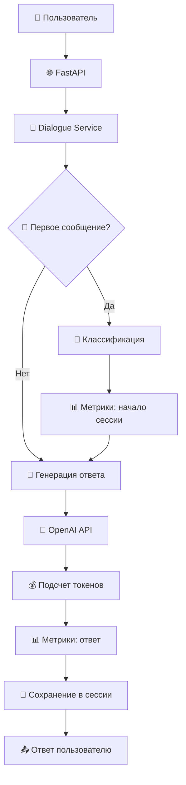

# 🤖 LLM Call Center Agent

[](https://python.org)
[](https://fastapi.tiangolo.com)
[](https://openai.com)
[](https://docker.com)

**Интеллектуальный агент колл-центра** с поддержкой OpenAI GPT моделей, автоматической классификацией запросов и контекстно-зависимыми диалогами.

## 🎯 Основные возможности

### 🧠 **Умная обработка запросов**
- **Автоматическая классификация**: техподдержка, продажи, жалобы, общие вопросы
- **Контекстные диалоги**: память о предыдущих сообщениях в рамках сессии
- **Адаптивные ответы**: разные стили общения для разных типов запросов

### ⚡ **Высокая производительность**
- **Асинхронная архитектура** на базе FastAPI
- **Точный подсчет токенов** и стоимости запросов
- **Кэширование ответов** для экономии средств
- **Интеллектуальная оптимизация**: модуль `optimizer.py` для автоматического выбора моделей и сжатия контекста
- **Метрики и аналитика** в реальном времени

### 🏗️ **Production-ready архитектура**
- **Типизированный код** с полной поддержкой mypy
- **Структурированное логирование** с structlog
- **Обработка ошибок** с детальными сообщениями
- **Docker контейнеризация** для простого развертывания

## 📚 Архитектура проекта

```
app/
├── 🎯 api/v1/              # REST API эндпоинты
│   ├── dialogue.py        # Управление диалогами
│   ├── health.py          # Проверка здоровья сервиса
│   ├── metrics.py         # Метрики и аналитика
│   └── router.py          # Роутинг API
├── 🧠 core/               # Основная бизнес-логика
│   ├── client.py          # OpenAI API клиент
│   ├── manager.py         # Менеджер сессий диалогов
│   ├── metrics.py         # Сбор метрик
│   ├── optimizer.py       # Оптимизация запросов
│   └── prompts.py         # Шаблоны промптов
├── 📊 models/             # Pydantic модели данных
│   ├── dialogue.py        # Модели диалогов
│   ├── enums.py          # Перечисления
│   ├── requests.py        # Модели запросов
│   └── metrics_response.py # Модели метрик
├── 🔧 services/           # Сервисный слой
│   ├── dialogue_service.py      # Обработка диалогов
│   └── classification_service.py # Классификация запросов
├── 💾 storage/            # Слой хранения данных
│   └── memory.py          # Хранение в памяти
└── 🛠️ utils/             # Утилиты
    ├── exceptions.py      # Кастомные исключения
    └── logger.py          # Настройка логирования
```

### 🔄 Поток обработки запроса



## 🚀 Быстрый старт

### Требования

- **Python 3.11+**
- **Poetry** для управления зависимостями
- **OpenAI API ключ**

### Установка

1. **Клонирование проекта:**
```bash
git clone https://github.com/softkisik228/LLM-Callcenter-Agent.git
cd llm-callcenter-agent
```

2. **Установка зависимостей:**
```bash
poetry install
```

3. **Настройка окружения:**
```bash
cp .env.example .env
```

Отредактируйте `.env` файл:
```bash
# Обязательные настройки
OPENAI_API_KEY=sk-ваш-ключ-openai

# Опциональные настройки
OPENAI_MODEL=gpt-4-1106-preview
OPENAI_TEMPERATURE=0.7
OPENAI_MAX_TOKENS=1000
OPENAI_TIMEOUT=30
LOG_LEVEL=INFO
```

4. **Запуск сервера разработки:**
```bash
# Использует переменные из .env файла
poetry run uvicorn app.main:app --reload

# Или с явным указанием хоста и порта
poetry run uvicorn app.main:app --reload --host ${HOST:-0.0.0.0} --port ${PORT:-8000}
```

5. **Открыть документацию API:**
```
http://localhost:8000/docs
```

### 🐳 Запуск с Docker

```bash
# Сборка и запуск
docker-compose up -d

# Просмотр логов
docker-compose logs -f app
```

## 💻 Примеры использования API

### 1. 🎬 Создание новой сессии диалога

**Запрос:**
```bash
curl -X POST "http://localhost:8000/api/v1/dialogue/start" \
  -H "Content-Type: application/json" \
  -d '{
    "customer_id": "user_12345",
    "customer_name": "Иван Петров",
    "initial_message": "Здравствуйте! У меня проблемы с входом в аккаунт",
    "priority": "high",
    "metadata": {
      "source": "web_chat",
      "user_agent": "Chrome/119.0"
    }
  }'
```

**Ответ:**
```json
{
  "session_id": "f47ac10b-58cc-4372-a567-0e02b2c3d479",
  "message": "Здравствуйте, Иван! Я помогу вам решить проблему с входом в аккаунт. Расскажите, пожалуйста, что именно происходит при попытке входа?",
  "request_type": "tech_support",
  "confidence": 0.95,
  "response_time_ms": 1250,
  "suggestions": []
}
```

### 2. 💬 Продолжение диалога

**Запрос:**
```bash
curl -X POST "http://localhost:8000/api/v1/dialogue/f47ac10b-58cc-4372-a567-0e02b2c3d479/message" \
  -H "Content-Type: application/json" \
  -d '{
    "message": "Я забыл пароль и не могу его восстановить",
    "metadata": {
      "timestamp": "2024-01-15T10:30:00Z"
    }
  }'
```

**Ответ:**
```json
{
  "session_id": "f47ac10b-58cc-4372-a567-0e02b2c3d479",
  "message": "Понимаю проблему. Для восстановления пароля, пожалуйста:\n1. Перейдите на страницу входа\n2. Нажмите 'Забыли пароль?'\n3. Введите ваш email\n4. Проверьте почту (включая спам)\n\nНа какой email зарегистрирован ваш аккаунт?",
  "request_type": "tech_support",
  "confidence": 0.95,
  "response_time_ms": 980,
  "suggestions": []
}
```

### 3. ⭐ Добавление обратной связи

**Запрос:**
```bash
curl -X POST "http://localhost:8000/api/v1/dialogue/f47ac10b-58cc-4372-a567-0e02b2c3d479/feedback" \
  -H "Content-Type: application/json" \
  -d '{
    "satisfaction_score": 4.5
  }'
```

**Ответ:**
```json
{
  "message": "Feedback recorded successfully"
}
```

### 4. 📋 Получение информации о сессии

**Запрос:**
```bash
curl -X GET "http://localhost:8000/api/v1/dialogue/f47ac10b-58cc-4372-a567-0e02b2c3d479"
```

**Ответ:**
```json
{
  "session_id": "f47ac10b-58cc-4372-a567-0e02b2c3d479",
  "status": "active",
  "message_count": 4,
  "request_type": "tech_support",
  "created_at": "2024-01-15T10:28:30.123456",
  "updated_at": "2024-01-15T10:35:15.789012"
}
```

### 5. 📊 Получение метрик системы

**Запрос:**
```bash
curl -X GET "http://localhost:8000/api/metrics/metrics"
```

**Ответ:**
```json
{
  "total_sessions": 156,
  "avg_response_time_ms": 1180.5,
  "total_tokens_used": 45230,
  "total_cost_usd": 0.7834,
  "avg_satisfaction": 4.2,
  "classification_accuracy": 0.92
}
```

### 6. 🔍 Получение истории сообщений

**Запрос:**
```bash
curl -X GET "http://localhost:8000/api/v1/dialogue/f47ac10b-58cc-4372-a567-0e02b2c3d479/messages?limit=10"
```

**Ответ:**
```json
{
  "session_id": "f47ac10b-58cc-4372-a567-0e02b2c3d479",
  "messages": [
    {
      "id": "msg_001",
      "role": "user",
      "content": "Здравствуйте! У меня проблемы с входом в аккаунт",
      "timestamp": "2024-01-15T10:28:30.123456",
      "metadata": {}
    },
    {
      "id": "msg_002", 
      "role": "assistant",
      "content": "Здравствуйте, Иван! Я помогу вам решить проблему...",
      "timestamp": "2024-01-15T10:28:31.373456",
      "metadata": {}
    }
  ]
}
```

## 🎛️ Конфигурация

### Основные настройки

| Параметр | Описание | По умолчанию |
|----------|----------|--------------|
| `APP_NAME` | Название приложения | `LLM Call Center Agent` |
| `APP_VERSION` | Версия приложения | `0.1.0` |
| `DEBUG` | Режим отладки | `false` |
| `LOG_LEVEL` | Уровень логирования | `INFO` |
| `HOST` | Хост для запуска сервера | `0.0.0.0` |
| `PORT` | Порт для запуска сервера | `8000` |
| `WORKERS` | Количество воркеров | `1` |
| `OPENAI_API_KEY` | API ключ OpenAI (обязательно) | - |
| `OPENAI_MODEL` | Модель для генерации ответов | `gpt-4-1106-preview` |
| `OPENAI_MAX_TOKENS` | Максимум токенов в ответе | `1000` |
| `OPENAI_TEMPERATURE` | Температура генерации (0.0-2.0) | `0.7` |
| `OPENAI_TIMEOUT` | Таймаут для OpenAI API (сек) | `30` |

> **📝 Примечание о переменных окружения:**
> - Переменные `HOST`, `PORT`, `WORKERS` используются Docker-контейнером
> - Переменные `APP_NAME`, `APP_VERSION`, `DEBUG` используются для настройки FastAPI приложения  
> - Все OpenAI переменные активно используются для работы с API
> - Переменная `LOG_LEVEL` управляет детализацией логирования

### Типы запросов и их обработка

#### 🔧 **Tech Support** (Техподдержка)
- **Промпт**: Пошаговые решения, уточняющие вопросы
- **Примеры**: "Не работает приложение", "Ошибка при входе"

#### 💰 **Sales** (Продажи) 
- **Промпт**: Консультативный подход, выявление потребностей
- **Примеры**: "Какие у вас тарифы?", "Хочу купить подписку"

#### 😠 **Complaint** (Жалобы)
- **Промпт**: Эмпатия, активное слушание, поиск решений
- **Примеры**: "Очень недоволен сервисом", "Требую возврат денег"

#### ❓ **General** (Общие вопросы)
- **Промпт**: Дружелюбный тон, перенаправление к нужному отделу
- **Примеры**: "Как дела?", "Где ваш офис?"

## 🎯 Модуль оптимизации (Optimizer)

Система включает в себя интеллектуальный модуль оптимизации (`app/core/optimizer.py`), который автоматически улучшает производительность и снижает затраты на API вызовы.

### 🚀 **Возможности оптимизатора**

#### 💾 **Кэширование ответов**
- Автоматическое кэширование частых запросов
- Настраиваемое время жизни кэша (TTL)
- Хэширование на основе контекста и параметров модели

#### 🧠 **Умный выбор модели**
- Автоматический выбор оптимальной модели на основе сложности запроса
- Использование более дешевых моделей для простых задач
- Переключение на мощные модели для сложных сценариев

#### ⚡ **Сжатие контекста**
- Автоматическое сокращение длинных сообщений
- Сохранение только релевантного контекста
- Оптимизация количества токенов в запросе

#### 💰 **Калькуляция стоимости**
- Точный подсчет стоимости каждого запроса
- Поддержка различных моделей OpenAI
- Детальная аналитика расходов

### 🛠️ **Настройка оптимизатора**

**Важно**: В текущей версии модуль оптимизации использует значения по умолчанию и не требует дополнительных настроек. Следующие возможности доступны через код:

```python
# Проверка настроек (используются значения по умолчанию)
enable_caching = getattr(settings, "enable_caching", False)  # По умолчанию: False
cost_optimization = getattr(settings, "cost_optimization", False)  # По умолчанию: False
cache_ttl = getattr(settings, "cache_ttl", 3600)  # По умолчанию: 1 час
max_context_messages = getattr(settings, "max_context_messages", 10)  # По умолчанию: 10
openai_model_fast = getattr(settings, "openai_model_fast", settings.openai_model)  # Fallback к основной модели
```

**Для активации функций оптимизации** необходимо добавить соответствующие поля в класс `Settings` в файле `app/config.py`:

```python
# В app/config.py
class Settings(BaseSettings):
    # ... существующие поля ...
    
    # Опции оптимизации
    enable_caching: bool = False
    cost_optimization: bool = False
    cache_ttl: int = 3600
    max_context_messages: int = 10
    openai_model_fast: str = "gpt-3.5-turbo-1106"
```

### 📋 **Пример использования**

```python
from app.core.optimizer import optimizer

# Автоматический выбор модели
optimal_model = optimizer.select_optimal_model(session)

# Сжатие контекста для экономии токенов
compressed_messages = optimizer.compress_context(messages)

# Проверка кэша перед API вызовом
cache_key = optimizer.get_cache_key(messages, model, temperature)
cached_response = optimizer.get_cached_response(cache_key)

if cached_response:
    response, tokens, cost = cached_response
else:
    # Выполнить API запрос
    response = await client.generate_response(...)
    # Сохранить в кэш
    optimizer.cache_response(cache_key, response, tokens, cost)
```

### 📊 **Метрики оптимизации**

Оптимизатор автоматически отслеживает:
- **Процент попадания в кэш** (cache hit rate)
- **Экономию средств** благодаря кэшированию
- **Выбор моделей** и их эффективность
- **Сжатие контекста** и экономию токенов

## 📊 Мониторинг и метрики

### Доступные метрики

- **Сессии**: Общее количество, активные сессии
- **Производительность**: Среднее время ответа, использование токенов
- **Качество**: Точность классификации, удовлетворенность клиентов
- **Затраты**: Общая стоимость, распределение по моделям

### Health Check эндпоинты

```bash
# Базовая проверка
curl http://localhost:8000/api/health

# Детальная проверка
curl http://localhost:8000/api/health/detailed
```

## 🛠️ Разработка

### Команды для разработки

```bash
# Установка зависимостей
poetry install

# Проверка типов
poetry run mypy .

# Форматирование кода
poetry run black .
poetry run isort .

# Линтинг
poetry run ruff check .

# Исправление линтинга
poetry run ruff check . --fix
```


## 🐳 Docker развертывание

### Локальная разработка

```bash
# Сборка образа
docker build -t llm-callcenter-agent .

# Запуск контейнера
docker run -p 8000:8000 \
  -e OPENAI_API_KEY=sk-ваш-ключ \
  -e OPENAI_MODEL=gpt-4-1106-preview \
  -e OPENAI_TIMEOUT=30 \
  -e LOG_LEVEL=INFO \
  llm-callcenter-agent
```

### Production развертывание

```yaml
# docker-compose.prod.yml
version: '3.8'

services:
  app:
    image: llm-callcenter-agent:latest
    ports:
      - "${PORT:-8000}:${PORT:-8000}"
    environment:
      - APP_NAME=${APP_NAME:-LLM Call Center Agent}
      - APP_VERSION=${APP_VERSION:-0.1.0}
      - DEBUG=${DEBUG:-false}
      - LOG_LEVEL=${LOG_LEVEL:-INFO}
      - HOST=${HOST:-0.0.0.0}
      - PORT=${PORT:-8000}
      - WORKERS=${WORKERS:-1}
      - OPENAI_API_KEY=${OPENAI_API_KEY}
      - OPENAI_MODEL=${OPENAI_MODEL:-gpt-4-1106-preview}
      - OPENAI_MAX_TOKENS=${OPENAI_MAX_TOKENS:-1000}
      - OPENAI_TEMPERATURE=${OPENAI_TEMPERATURE:-0.7}
      - OPENAI_TIMEOUT=${OPENAI_TIMEOUT:-30}
    restart: unless-stopped
    healthcheck:
      test: ["CMD", "curl", "-f", "http://localhost:${PORT:-8000}/api/health"]
      interval: 30s
      timeout: 10s
      retries: 3
```

## 📝 Лицензия

MIT License - см. файл [LICENSE](LICENSE)
